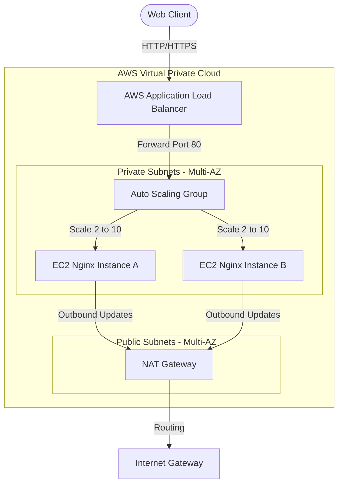

# AWS Nginx Setup with Auto Scaling

AWS infrastructure running containerized Nginx behind an ALB. Automatically scales up/down based on CPU load. 

## Visuals

### Web Dashboard


### CLI Check


## Specs
* **IaC**: VPC, subnet division, NAT gateway, ALB. Provisioned via Terraform.
* **Auto Scaling**: ASG scales from 2 to 10 instances. Target policy set to 70% CPU limit.
* **Docker**: Two-stage build validating assets before copying to the final Nginx container.
* **Monitoring**: Metrics available at `/metrics` and health checks at `/healthz`.
* **CI/CD**: GitHub Actions pipeline for checks, pushing to ECR, and running Terraform apply.

---

## Architecture



---

## Directory Structure

```
.
├── .github/
│   └── workflows/
│       └── deploy.yml          # GitHub Actions CI/CD Pipeline
├── Dockerfile                  # Multi-stage Docker file
├── nginx.conf                  # Nginx configuration
├── package.json                # Validation scripts and config
├── verify_production.sh        # Verification script
├── src/
│   ├── index.html              # Main HTML page
│   └── styles.css              # Custom CSS stylesheet
├── k8s/
│   ├── deployment.yaml         # K8s deployment
│   ├── service.yaml            # Cluster Service config
│   ├── ingress.yaml            # Ingress config (ALB bindings)
│   └── hpa.yaml                # Autoscaling config
└── terraform/
    ├── main.tf                 # VPC, ALB, ASG definitions
    ├── variables.tf            # Config inputs
    ├── outputs.tf              # DNS endpoint output
    └── providers.tf            # AWS & local providers
```

---

## Testing Locally

We have a Node.js sandbox mimicking the Nginx/AWS APIs on port `8080`.

### 1. Run Lints and Tests
```bash
npm run lint && npm run test
```

### 2. Start Local Mock Server
```bash
node .gemini/antigravity-cli/brain/e126aaa6-754e-4258-bbed-5da887918436/scratch/sandbox_test.js
```
Query local endpoints in another shell window:
```bash
curl -s http://localhost:8080/
curl -s http://localhost:8080/healthz
curl -s http://localhost:8080/metrics
```

---

## Deploying to AWS

### Prerequisites
* AWS CLI installed and configured.
* Terraform (`>= 1.5.0`).

### 1. Init & Validate
```bash
cd terraform
terraform init
terraform validate
```

### 2. View Plan
```bash
terraform plan
```

### 3. Deploy
This builds the VPC, NAT, ALB, and ASG. Takes about 3 mins.
```bash
terraform apply -auto-approve
```

---

## Prod Checks

Use the check script in the root to test the active deployment:
```bash
bash verify_production.sh
```

### Manual CLI Tests

#### A. Web Page Status
```bash
curl -s -o /dev/null -w "HTTP Status: %{http_code}\n" http://scalable-nginx-alb-1730992489.us-east-1.elb.amazonaws.com/
```

#### B. Health Endpoint Check
```bash
curl -s http://scalable-nginx-alb-1730992489.us-east-1.elb.amazonaws.com/healthz
```
*Response should be: `OK`*

#### C. Get Metrics
```bash
curl -s http://scalable-nginx-alb-1730992489.us-east-1.elb.amazonaws.com/metrics
```

#### D. Failover Test
1. List running instances:
    ```bash
    aws ec2 describe-instances --filters "Name=tag:Name,Values=scalable-nginx-worker" "Name=instance-state-name,Values=running" --query "Reservations[*].Instances[*].[InstanceId,State.Name]" --output table
    ```
2. Kill one VM:
    ```bash
    aws ec2 terminate-instances --instance-ids <INSTANCE_ID>
    ```
3. Test curl again. The ALB routes request to the remaining instance. ASG launches a replacement VM in ~3 minutes.

---

## Tech Stack
* AWS
* Terraform
* Nginx
* Docker
* Bash / Node.js
* CSS (responsive dark theme)
