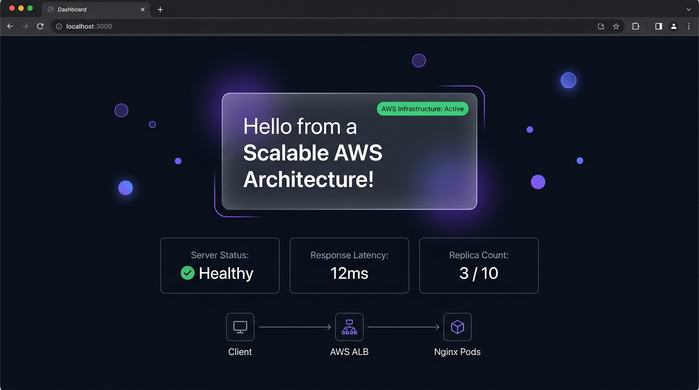
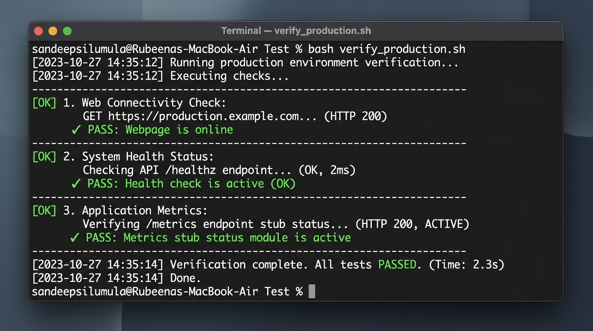

# Scalable AWS Nginx Webpage Architecture

A production-grade, highly scalable web application hosting architecture built on Amazon Web Services (AWS). This system runs a custom, modern containerized Nginx web server across multiple private subnets behind an Application Load Balancer (ALB), automatically scaling in response to CPU load.

## Visual Showcase

### Web Dashboard Interface


### Terminal Verification



## Features
*   **Infrastructure as Code (IaC)**: Fully provisioned via Terraform, establishing a secure AWS VPC, public/private subnet segmentation, Internet/NAT Gateways, and ALB.
*   **Dynamic Auto Scaling**: Configured with an AWS Auto Scaling Group (ASG) utilizing a **Target Tracking policy targeting 70% average CPU usage** (supporting 2 to 10 instances).
*   **Multi-Stage Dockerization**: Leverages multi-stage Docker builds to validate asset content before packaging the final optimized Nginx production server.
*   **Observability & Telemetry**: Native Nginx performance metric endpoints (`/metrics`) and Kubernetes-compatible health checks (`/healthz`).
*   **CI/CD Integration**: Out-of-the-box GitHub Actions workflow managing automatic syntax validations, ECR container publishing, and Terraform deployment.

---

## System Architecture


---

## Directory Structure

```
.
├── .github/
│   └── workflows/
│       └── deploy.yml          # GitHub Actions CI/CD Pipeline
├── Dockerfile                  # Multi-stage Docker file
├── nginx.conf                  # Custom high-performance Nginx configuration
├── package.json                # Project script commands and validation configs
├── verify_production.sh        # Copy-pasteable terminal verification script
├── src/
│   ├── index.html              # Custom landing page web page
│   └── styles.css              # Premium CSS stylesheet
├── k8s/
│   ├── deployment.yaml         # Kubernetes pod deployment rules
│   ├── service.yaml            # Cluster Service configurations
│   ├── ingress.yaml            # Application Load Balancer bindings
│   └── hpa.yaml                # Horizontal Pod Autoscaler scaling configuration
└── terraform/
    ├── main.tf                 # Core VPC, ALB, and ASG resource configurations
    ├── variables.tf            # Parameterized infrastructure inputs
    ├── outputs.tf              # DNS endpoint outputs
    └── providers.tf            # AWS and provider definitions
```

---

## Local Verification & Emulation

Since cloud deployments can take time, this project includes a local Node.js sandbox that emulates Nginx and AWS endpoints (Port `8080`).

### 1. Run Workspace Linting
Validates file structure, configurations, and observability hooks:
```bash
npm run lint && npm run test
```

### 2. Launch Local Mock Sandbox
Test the web pages and telemetry endpoints locally:
```bash
node .gemini/antigravity-cli/brain/e126aaa6-754e-4258-bbed-5da887918436/scratch/sandbox_test.js
```
Query endpoints on another terminal tab:
```bash
curl -s http://localhost:8080/
curl -s http://localhost:8080/healthz
curl -s http://localhost:8080/metrics
```

---

## Infrastructure Deployment (AWS)

### Prerequisites
*   AWS CLI installed and authenticated with your target AWS Account.
*   Terraform CLI (`>= 1.5.0`) installed.

### 1. Initialize and Validate Configurations
```bash
cd terraform
terraform init
terraform validate
```

### 2. Preview Infrastructure Plan
```bash
terraform plan
```

### 3. Deploy to AWS
Apply the configuration (takes ~3 minutes to provision VPC, NAT Gateway, ALB, and ASG):
```bash
terraform apply -auto-approve
```

---

## Production Verification Guide

A copy-pasteable script is located in the root of the project. Simply run it to run full diagnostic check suites:

```bash
bash verify_production.sh
```

### Step-by-Step CLI Diagnostics

#### A. Query Server Accessibility
Check if the ALB is resolving and returning the landing page:
```bash
curl -s -o /dev/null -w "HTTP Status: %{http_code}\n" http://scalable-nginx-alb-1730992489.us-east-1.elb.amazonaws.com/
```

#### B. Check Health Check Endpoint
Query the Load Balancer target group endpoint:
```bash
curl -s http://scalable-nginx-alb-1730992489.us-east-1.elb.amazonaws.com/healthz
```
*Expected output: `OK`*

#### C. Inspect Telemetry Statistics
Query Nginx active connection metrics:
```bash
curl -s http://scalable-nginx-alb-1730992489.us-east-1.elb.amazonaws.com/metrics
```

#### D. Verify Self-Healing (EC2 Failover)
1.  List the running instances:
    ```bash
    aws ec2 describe-instances --filters "Name=tag:Name,Values=scalable-nginx-worker" "Name=instance-state-name,Values=running" --query "Reservations[*].Instances[*].[InstanceId,State.Name]" --output table
    ```
2.  Terminate one instance:
    ```bash
    aws ec2 terminate-instances --instance-ids <INSTANCE_ID>
    ```
3.  Query the server again. The webpage remains online because the ALB redirects traffic to the healthy standby instance. Within 3 minutes, the ASG will boot a new healthy instance to restore desired capacity.

---

## Technology Stack
*   **Hosting Platform**: Amazon Web Services (AWS)
*   **Infrastructure Automation**: Terraform
*   **Web Server**: Nginx
*   **Containerization**: Docker
*   **Configuration Manager**: Zsh / Bash / Node.js
*   **Styling**: Premium Vanilla CSS (Responsive, Dark Theme)
# cloudscale-nginx-aws
